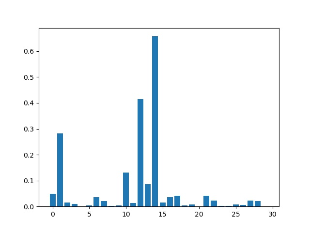

# semi_surpervised
与监督学习相比，半监督融合了有label的data和无label的data一同训练模型。因为，在实际情况中，我们很难获得大量的有label的data，但是却能获得大量无label的data。而无label的data也存在着有效的信息能够帮助我们在数据量少的情况下找到理想的function。在这里，我采用了半监督学习中的low-density separation assumption来挖掘无label的data的信息。对于给定的image，我们希望模型能够给出一个“驼峰型”的probability distribution。在“驼峰型”的probability distribution中，某个label的概率较高，而其它label的概率偏低。因此，我们使用了无label的datad的熵来正则化模型的参数。单元函数的熵如图所示，从中我们可知，当预测概率趋于驼峰分布时，无label的data的熵会减少；而当预测概率区域均匀分布时，无label的data的熵会增加。 
  
在这里，我们使用了猫狗数据集和resnet18进行了两组对照试验--半监督和监督。分组分别包含了三次实验，每次实验的unlabel_data比例为0.3，0.5和0.7。它们的的学习曲线和正确率分别如下图所示。  
  
  
  
从上图可知，无论是半监督还是监督，两者的模型的学习曲线和准确率都很相近。在理论上，由于半监督的dataset包含了监督的dataset，所以半监督模型的性能要大于或等于监督模型的性能。在unlabel_ratio为0.5的实验中，半监督的模型的准确率比监督的模型高1.%左右。而在其它两个对比实验中，两者则相近。除了比较两者的学习曲线和准确率，我们还从样本的熵以及预测probability的分布来比较两者的差异。  
（在这里，我们选择了unlabel_ratio=0.5的训练模型。前为半监督模型，后为监督模型。）  
样本熵  

预测的probability distribution  

  
在随机抽选的30个样本的熵的分布情况来看，半监督模型整体的样本熵较低，而监督模型的整体熵则偏高。这说明了对于给定的image,半监督模型能够很好地生成一个“驼峰型”的probability distribution。这在下面的样本probability distribution中也很好地得到验证。  
此外，我还使用了grad-cam来可视化模型的感兴趣区域。  

  
从上图可知，虽然两者都无法完全定位到猫头，但是显然半监督模型的感兴趣区域较完善。这也证明了无label的data能够为模型提供有效的信息。
